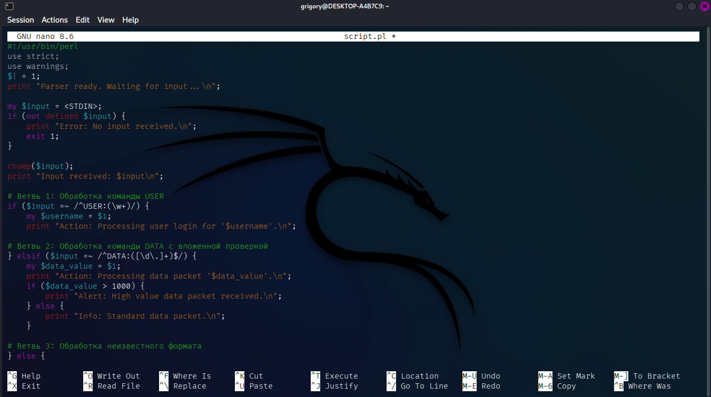
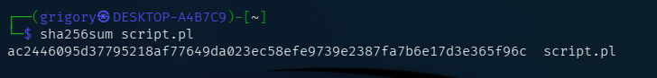
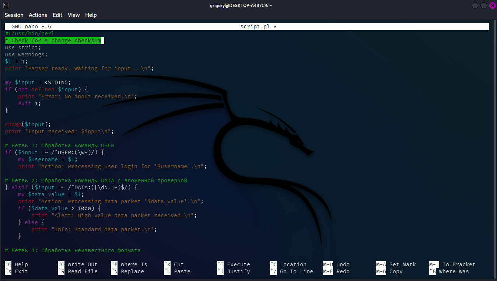

# Лабораторная работа №1 
Расчёт контрольной суммы
1. Создаём скрипт perl


2. Прописываем в терминале команду sha256sum script.pl


Для проверки изменения контрольной суммы, откроем скрипт в nano и добавим комментарий


Снова прописываем в терминале sha256sum script.pl


# Вывод
Контрольная сумма файла изменилась после редактирования, даже несмотря на то, что была добавлена лишь строка комментария. Это подтверждает, что хэш-функции чувствительны к любым изменениям содержимого файла и позволяют надёжно отслеживать целостность данных.

# Лабораторная работа №2
Фаззинг-тестирование
1. Установка зависимостей
```
sudo apt update
sudo apt install build-essential clang llvm-dev libstdc++-dev -y
```
2. Клонирование репозитория
```
git clone https://github.com/AFLplusplus/AFLplusplus.git
cd AFLplusplus
```
3. Компиляция и установка
```
make all
sudo make install
```
4. Создание C-обертки wrapper.c
Обоснование использования C-обертки с инструментацией
  1. Проблема совместимости архитектур
     Скрипт script.pl является текстовым файлом, исполняемым интерпретатором /usr/bin/perl, и не может быть скомпилирован afl-cc напрямую.
  2. Управление потоками ввода
     Целевой Perl-скрипт ожидает данные через стандартный ввод (STDIN). AFL++ по умолчанию генерирует входные данные в виде файлов. Обертка wrapper.c эффективно решает задачу перенаправления: она принимает путь к файлу от AFL++ (через аргумент @@) и перенаправляет его содержимое в STDIN перед вызовом интерпретатора Perl
     
