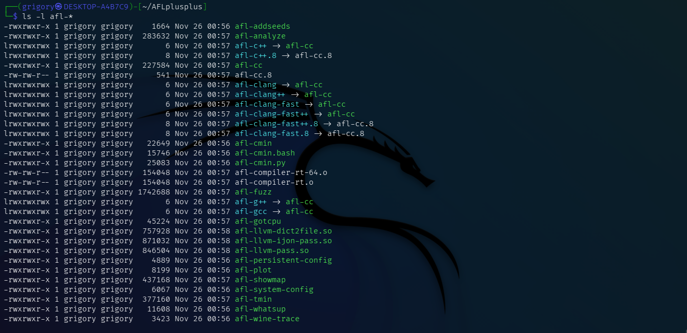

# Подготовка среды kali linux 
1. Установим необходимые инструменты.
```
sudo apt update
sudo apt install -y build-essential clang llvm gcc make git wget
sudo apt install -y build-essential clang llvm libtool autoconf automake python3 python3-dev
```
2. Скачивание Perl

Создадим папку для работы и перейдём в неё
```
cd ~
mkdir perl_fuzzing
cd perl_fuzzing
```
И скачаем исходники Perl
```
wget https://www.cpan.org/src/5.0/perl-5.38.2.tar.gz
tar -xzvf perl-5.38.2.tar.gz
cd perl-5.38.2
```
# Лабораторная работа №1 
Расчёт контрольной суммы

Выполним команду для подсчёта контрольной суммы всех сурс файлов отдельно друг от друга и учтём, что подсчет контрольных сумм производился непосредственно в рабочем каталоге после фаззинг-тестирования и сбора покрытия, поэтому исключим все сгенерированные временные файлы и выходные данные.
```
find . -type f \
  -not -path "./out/*" \
  -not -path "./in/*" \
  -not -path "./coverage_inputs/*" \
  -not -path "./coverage_report/*" \
  -not -name "*.gcda" \
  -not -name "*.gcno" \
  -not -name "coverage.info" \
  -exec sha256sum {} + > checksums.txt
```
После выполнения команды получаем текстовый файл **[(checksums.txt)](./checksums.txt)**

# Лабораторная работа №2
Фаззинг-тестирование
1. Установка зависимостей
```
sudo apt update
sudo apt install build-essential clang llvm-dev libstdc++-dev -y
```
2. Клонирование репозитория
```
cd ~
git clone https://github.com/AFLplusplus/AFLplusplus
cd AFLplusplus
```
3. Компиляция и установка
```
make all
sudo make install
```
Проверим установленные компиляторы
```
ls -l afl-*
```

4. Выполним сборку всех модулей
```
make distrib
sudo make install
```
5. Компиляция Perl с "инструментацией"

Выполним сборку Perl с использованием компилятора AFL (в нашем случае - afl-gcc)
- Настройка
```
CC=afl-gcc CXX=afl-g++ ./Configure -des -Dcc=afl-gcc -Dprefix=$(pwd)/installed_perl
```
- Сборка
```
make -j$(nproc)
```
- Создание папок для фаззинга и корпуса
```
mkdir -p in out
echo 'print "Hello World\n";' > in/test.pl
```
6. Запуск фаззинга
```
afl-fuzz -i in -o out -- ./perl @@
```

# Вывод
Высокое покрытие функций подтверждает, что вся логика C-обертки была активирована, а покрытие строк, превышающее половину, доказывает успешный прогон кода. Непокрытые строки соответствуют коду обработки исключений, который не был выполнен при успешном запуске Perl-скрипта.
