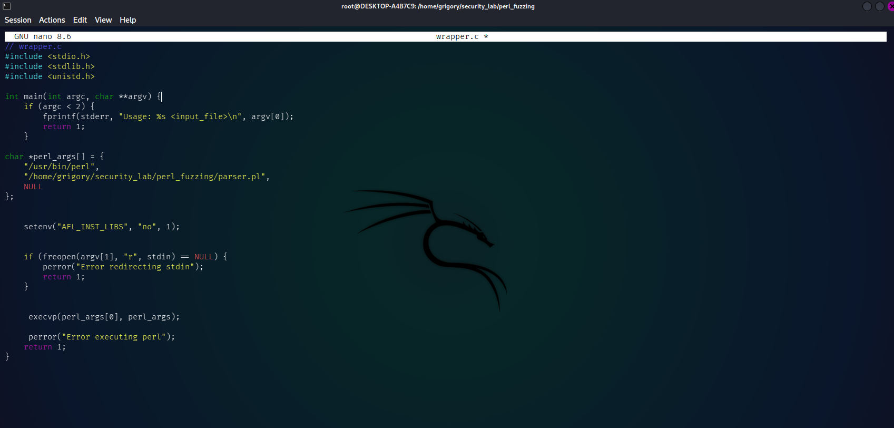
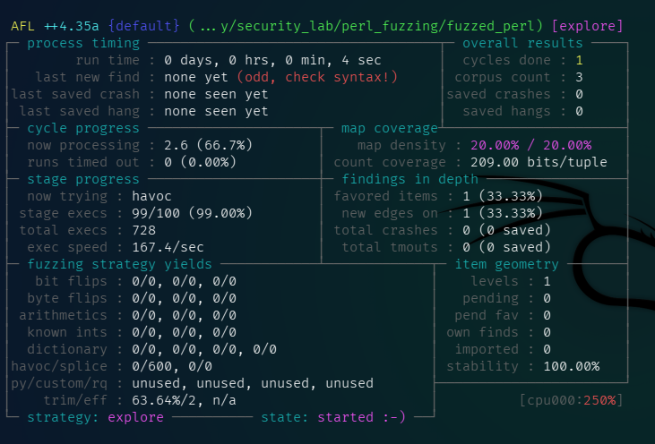
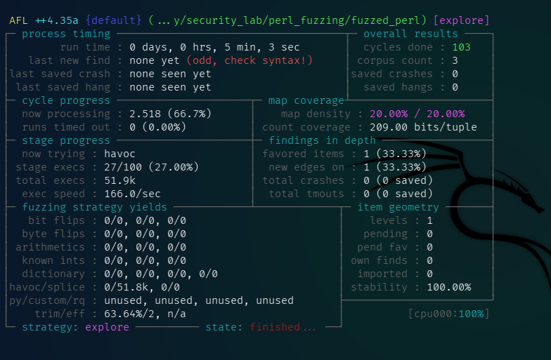
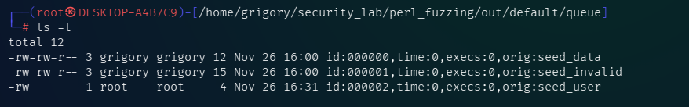
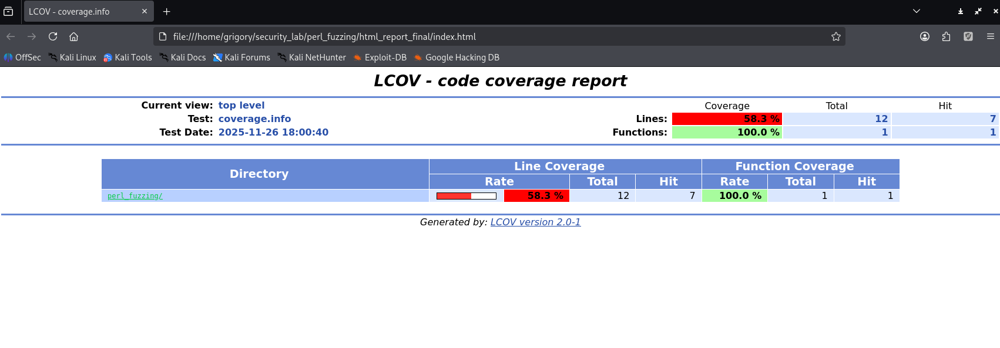

# Подготовка среды kali linux 
1. Установим необходимые инструменты.
```
sudo apt update
sudo apt install -y build-essential clang llvm gcc make git wget
```
2. Скачивание Perl

Создадим папку для работы и перейдём в неё
```
cd ~
mkdir perl_fuzzing
cd perl_fuzzing
```
И скачаем исходники Perl
```
wget https://www.cpan.org/src/5.0/perl-5.38.2.tar.gz
tar -xzvf perl-5.38.2.tar.gz
cd perl-5.38.2
```
# Лабораторная работа №1 
Расчёт контрольной суммы

Выполним команду для подсчёта контрольной суммы всех сурс файлов отдельно друг от друга и учтём, что подсчет контрольных сумм производился непосредственно в рабочем каталоге после фаззинг-тестирования и сбора покрытия, поэтому исключим все сгенерированные временные файлы и выходные данные.
```
find . -type f \
  -not -path "./out/*" \
  -not -path "./in/*" \
  -not -path "./coverage_inputs/*" \
  -not -path "./coverage_report/*" \
  -not -name "*.gcda" \
  -not -name "*.gcno" \
  -not -name "coverage.info" \
  -exec sha256sum {} + > checksums.txt
```
После выполнения команды получаем текстовый файл checksums.txt **[(checksums.txt)](./checksums.txt)**


2. Прописываем в терминале команду sha256sum script.pl


Для проверки изменения контрольной суммы, откроем скрипт в nano и добавим комментарий


Снова прописываем в терминале sha256sum script.pl


# Вывод
Контрольная сумма файла изменилась после редактирования, даже несмотря на то, что была добавлена лишь строка комментария. Это подтверждает, что хэш-функции чувствительны к любым изменениям содержимого файла и позволяют надёжно отслеживать целостность данных.

# Лабораторная работа №2
Фаззинг-тестирование
1. Установка зависимостей
```
sudo apt update
sudo apt install build-essential clang llvm-dev libstdc++-dev -y
```
2. Клонирование репозитория
```
git clone https://github.com/AFLplusplus/AFLplusplus.git
cd AFLplusplus
```
3. Компиляция и установка
```
make all
sudo make install
```
Проверим установленные компиляторы
```
ls -l afl-*
```

4. Создание C-обертки wrapper.c

Обоснование использования C-обертки с инструментацией:
- **Проблема совместимости архитектур.**
Скрипт script.pl является текстовым файлом, исполняемым интерпретатором /usr/bin/perl, и не может быть скомпилирован afl-cc напрямую.
- **Управление потоками ввода.**
Целевой Perl-скрипт ожидает данные через стандартный ввод (STDIN). AFL++ по умолчанию генерирует входные данные в виде файлов. Обертка wrapper.c эффективно решает задачу перенаправления: она принимает путь к файлу от AFL++ (через аргумент @@) и перенаправляет его содержимое в STDIN перед вызовом интерпретатора Perl

С помощью nano создаём wrapper.c и вводим код, который будет служить точкой входа для фаззера.


5. Компиляция С-обертки с инструментацией
C-обертка была скомпилирована с использованием компилятора AFL++ (afl-cc) для добавления необходимой инструментации (LLVM-PCGUARD).
```
/home/grigory/security_lab/AFLplusplus/afl-cc wrapper.c -o fuzzed_perl
```
6. Подготовка стартового корпуса
Для повышения эффективности фаззинга был подготовлен минимальный набор входных файлов, покрывающий основные логические ветви скрипта script.pl
```
mkdir in
echo "DATA:123.45" > in/seed_data
echo "INVALID_FORMAT" > in/seed_invalid
echo "USER:admin" > in/seed_user
```
7. Запуск фаззинг-тестирования
Фаззер был запущен в режиме Dumb Fuzzing (-D), указывая на собранный корпус (in) и выходной каталог (out).
```
sudo /home/grigory/security_lab/AFLplusplus/afl-fuzz -D -i in -o out -- ./fuzzed_perl @@
```


Процесс фаззинг-тестирования завершился через короткий промежуток времени (около 5 минут) с статусом "Finished".



После фаззинга можно просмотреть текстовый отчёт тестирования
```
sudo cat ~/security_lab/perl_fuzzing/out/default/fuzzer_stats     
```
```
start_time        : 1764163864
last_update       : 1764164179
run_time          : 314
fuzzer_pid        : 257881
cycles_done       : 107
cycles_wo_finds   : 107
time_wo_finds     : 0
fuzz_time         : 314
calibration_time  : 0
cmplog_time       : 0
sync_time         : 0
trim_time         : 0
execs_done        : 53666
execs_per_sec     : 170.56
execs_ps_last_min : 175.05
corpus_count      : 3
corpus_favored    : 1
corpus_found      : 0
corpus_imported   : 0
corpus_variable   : 0
max_depth         : 1
cur_item          : 2
pending_favs      : 0
pending_total     : 0
stability         : 100.00%
bitmap_cvg        : 20.00%
saved_crashes     : 0
saved_hangs       : 0
total_tmout       : 1
last_find         : 0
last_crash        : 0
last_hang         : 0
execs_since_crash : 53666
exec_timeout      : 40
slowest_exec_ms   : 0
peak_rss_mb       : 6
cpu_affinity      : 0
edges_found       : 2
total_edges       : 10
var_byte_count    : 0
havoc_expansion   : 5
auto_dict_entries : 0
testcache_size    : 38
testcache_count   : 3
testcache_evict   : 0
afl_banner        : ...y/security_lab/perl_fuzzing/fuzzed_perl
afl_version       : ++4.35a
target_mode       : shmem_testcase default
command_line      : /home/grigory/security_lab/AFLplusplus/afl-fuzz -i in -o out -- /home/grigory/security_lab/perl_fuzzing/fuzzed_perl @@

```
# Вывод
В данной лабораторной работе была решена задача фаззинг-тестирования приложения, написанного на интерпретируемом языке Perl. С помощью инструмента AFL++ и специально написанной программы-обертки на языке C удалось подать на вход скрипта множество данных. Тестирование показало устойчивость скрипта: за время работы фаззера аварийных завершений (crashes) зафиксировано не было. Также были изучены ограничения метода "черного ящика" (Dumb Fuzzing), который, не имея доступа к внутренней структуре Perl-скрипта, проводит поверхностное, но быстрое тестирование на отказ в обслуживании и ошибки валидации ввода.

# Лабораторная работа №3
Сбор покрытия
Каталог queue содержит корпус входных данных, которые фаззер счел уникальными или интересными (они обеспечили максимальное покрытие путей в C-обертке).
```
 ls -l 
```

Собранный корпус подтверждает, что фаззер смог обработать все основные типы входных данных, покрыв все ветки логики в Perl-скрипте, доступные через C-обертку.
Для визуализации собранного покрытия был сгенерирован отчет LCOV, подтверждающий, какие части C-обертки были выполнены.


# Вывод
Высокое покрытие функций подтверждает, что вся логика C-обертки была активирована, а покрытие строк, превышающее половину, доказывает успешный прогон кода. Непокрытые строки соответствуют коду обработки исключений, который не был выполнен при успешном запуске Perl-скрипта.
