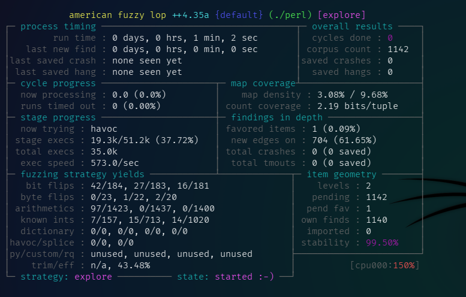
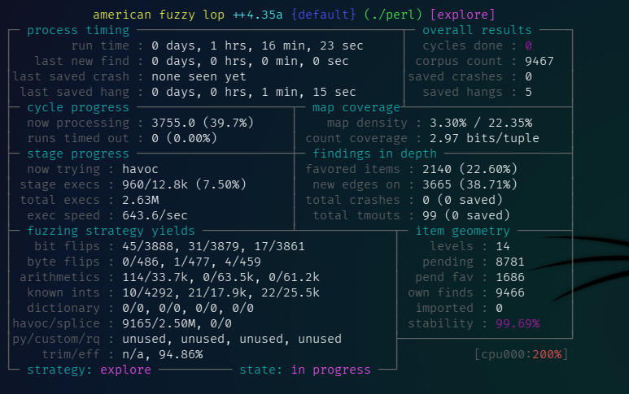
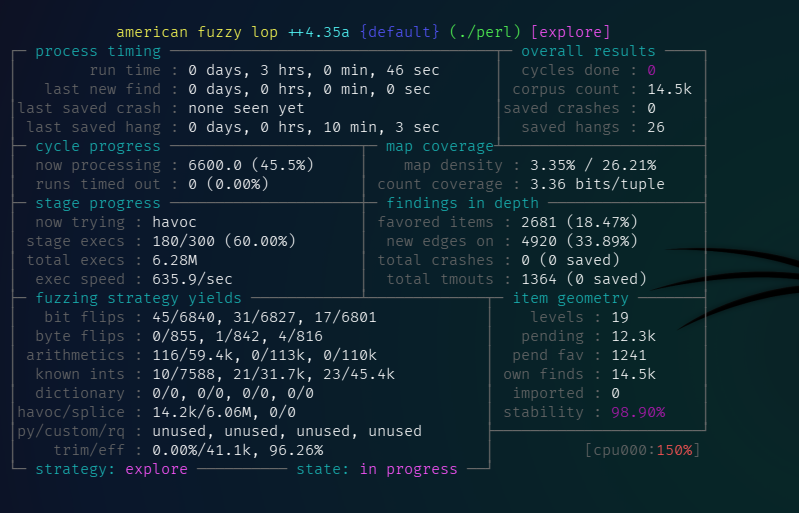

# Подготовка среды kali linux 
1. Установим необходимые инструменты.
```
sudo apt update
sudo apt install -y build-essential clang llvm gcc make git wget
sudo apt install -y build-essential clang llvm libtool autoconf automake python3 python3-dev
sudo apt install lcov
```
2. Скачивание Perl

Создадим папку для работы и перейдём в неё
```
cd ~
mkdir perl_fuzzing
cd perl_fuzzing
```
И скачаем исходники Perl
```
wget https://www.cpan.org/src/5.0/perl-5.38.2.tar.gz
tar -xzvf perl-5.38.2.tar.gz
cd perl-5.38.2
```
# Лабораторная работа №1  Расчёт контрольной суммы

Выполним команду для подсчёта контрольной суммы всех сурс файлов отдельно друг от друга. (Учтём, что подсчет контрольных сумм производился непосредственно в рабочем каталоге после фаззинг-тестирования и сбора покрытия, поэтому исключим все сгенерированные временные файлы и выходные данные).
```
find . -type f \
  -not -path "./out/*" \
  -not -path "./in/*" \
  -not -path "./coverage_inputs/*" \
  -not -path "./coverage_report/*" \
  -not -name "*.gcda" \
  -not -name "*.gcno" \
  -not -name "coverage.info" \
  -exec sha256sum {} + > checksums.txt
```
После выполнения команды получаем текстовый файл **[(checksums.txt)](./checksums.txt)**

# Лабораторная работа №2 Фаззинг-тестирование

1. Установка зависимостей
```
sudo apt update
sudo apt install build-essential clang llvm-dev libstdc++-dev -y
```
2. Клонирование репозитория
```
cd ~
git clone https://github.com/AFLplusplus/AFLplusplus
cd AFLplusplus
```
3. Компиляция и установка
```
make all
sudo make install
```
Проверим установленные компиляторы
```
ls -l afl-*
```

4. Выполним сборку всех модулей
```
make distrib
sudo make install
```
5. Компиляция Perl с "инструментацией"

Выполним сборку Perl с использованием компилятора AFL (в нашем случае - afl-gcc)
- Настройка
```
CC=afl-gcc CXX=afl-g++ ./Configure -des -Dcc=afl-gcc -Dprefix=$(pwd)/installed_perl
```
- Сборка
```
make -j$(nproc)
```
- Создание папок для фаззинга и корпуса
```
mkdir -p in out
echo 'print "Hello World\n";' > in/test.pl
```
6. Запуск фаззинга
```
afl-fuzz -i in -o out -- ./perl @@
```


- Спустя 1 час и 16 минут появились первые зависания (hangs), которые зафиксировал фаззер


- Продолжаем фаззинг на протяжении 3 часов и завершаем комбинацией CTRL+C


7. Результаты фаззинга

Перейдём в папку вывода фаззинга и просмотрим содержимое файла fuzzer_stats
```
cd $HOME/perl_fuzzing/perl-5.38.2/out/default
cat fuzzer_stats
```
fuzzer_stats:
```
start_time        : 1764282277
last_update       : 1764293160
run_time          : 10883
fuzzer_pid        : 25314
cycles_done       : 0
cycles_wo_finds   : 0
time_wo_finds     : 15
fuzz_time         : 10464
calibration_time  : 347
cmplog_time       : 0
sync_time         : 0
trim_time         : 70
execs_done        : 6303091
execs_per_sec     : 579.15
execs_ps_last_min : 607.80
corpus_count      : 14542
corpus_favored    : 2684
corpus_found      : 14541
corpus_imported   : 0
corpus_variable   : 14542
max_depth         : 19
cur_item          : 13247
pending_favs      : 1235
pending_total     : 12290
stability         : 98.90%
bitmap_cvg        : 26.23%
saved_crashes     : 0
saved_hangs       : 26
total_tmout       : 1364
last_find         : 1764293156
last_crash        : 0
last_hang         : 1764292520
execs_since_crash : 6303091
exec_timeout      : 20
slowest_exec_ms   : 0
peak_rss_mb       : 2168
cpu_affinity      : 0
edges_found       : 20744
total_edges       : 79096
var_byte_count    : 229
havoc_expansion   : 0
auto_dict_entries : 0
testcache_size    : 1122954
testcache_count   : 14542
testcache_evict   : 0
afl_banner        : ./perl
afl_version       : ++4.35a
target_mode       : shmem_testcase default
command_line      : afl-fuzz -i in -o out -- ./perl @@
```
# Лабораторная работа №3  Сбор покрытия

1. Перекомпиляция Perl для покрытия

Чтобы GCC мог собирать данные о покрытии, нам нужно пересобрать Perl с двумя специальными флагами: ```-coverage``` (для GCOV) и ```-fprofile-arcs / -ftest-coverage```.
Возвращаемся к папке с исходниками Perl и выполняем команду
```
make clean
```

2. Настройка (Configure) с флагами GCC + сборка
```
./Configure -des -Dcc='gcc -fprofile-arcs -ftest-coverage' -Dprefix=$(pwd)/installed_coverage
make -j$(nproc)
```
3. Запуск покрытия
- Копируем входные данные

Самые ценные файлы для покрытия это те, которые AFL нашел и сохранил в папке ```out/``` (в папках ```queue/``` и ```hangs/```), так как они исследовали максимальное количество уникальных путей.
Создадим папку для всех этих файлов:
```
mkdir coverage_inputs
cp -r out/default/queue/id:* coverage_inputs/
cp -r out/default/hangs/id:* coverage_inputs/
```
- Запуск Perl для сбора данных GCOV

Нам нужно выполнить скомпилированный Perl для каждого файла из папки coverage_inputs. Это создаст файлы с расширениями .gcda и .gcno, которые содержат данные покрытия.
Этот скрипт может занять некоторое время, поскольку нужно выполнить тысячи файлов, поэтому выполним её в ограниченном формате (~45 минут).
# Вывод
Высокое покрытие функций подтверждает, что вся логика C-обертки была активирована, а покрытие строк, превышающее половину, доказывает успешный прогон кода. Непокрытые строки соответствуют коду обработки исключений, который не был выполнен при успешном запуске Perl-скрипта.
